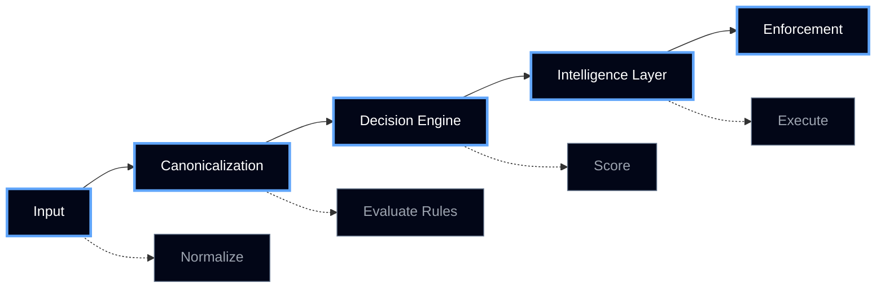
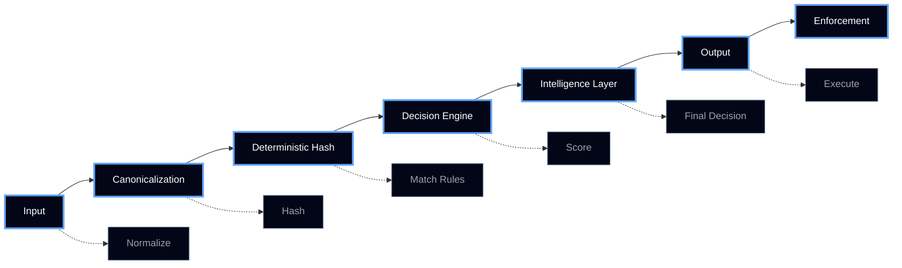
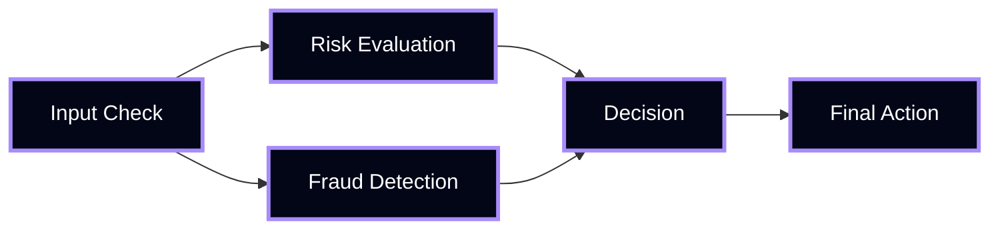
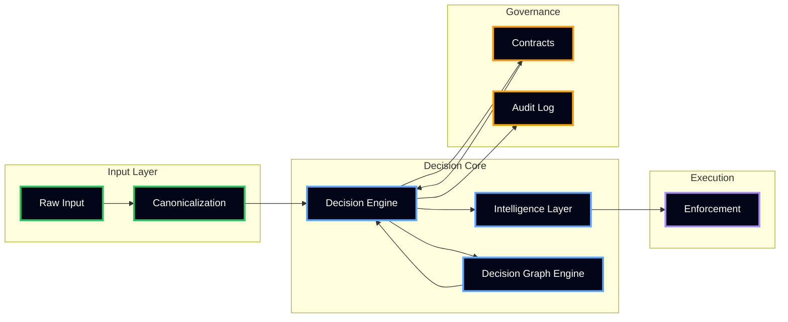

# Architecture

Manthan is a **deterministic decision infrastructure** built as layered components with strict execution guarantees.

---

## System Flow

---

## Execution Pipeline

---

## Decision Graph (Dependency Execution)

---

## System Architecture (Layered View)

---

## Component Overview

### Canonicalization
**Purpose:** Normalize input into a stable format

- Sort keys  
- Normalize values  
- Remove ambiguity  

**Output:** Stable hash

---

### Decision Engine
**Purpose:** Core decision computation

- Rule-based  
- Fixed execution order  
- First-match wins  
- No randomness  

---

### Intelligence Layer
**Purpose:** Add structured metadata

- Score  
- Confidence  
- Priority  
- Explanation  

---

### Decision Graphs
**Purpose:** Handle multi-step dependencies

- DAG only  
- Topological execution  
- No cycles  

---

### Contracts
**Purpose:** Define decision behavior

- Versioned  
- Immutable  
- Auditable  

---

### Enforcement
**Purpose:** Apply decisions externally

- GitHub PR blocking  
- API enforcement  
- Workflow control  

---

## System Properties

- Deterministic execution (no randomness)  
- Immutable contract-based logic  
- Full auditability via append-only logs  
- Graph-based dependency resolution  

---

## System Guarantee

> **Same Input → Same Output → Always**

---

## Design Principles

- Determinism over intelligence  
- Explicit over implicit  
- Versioned over mutable  
- Auditability over performance  