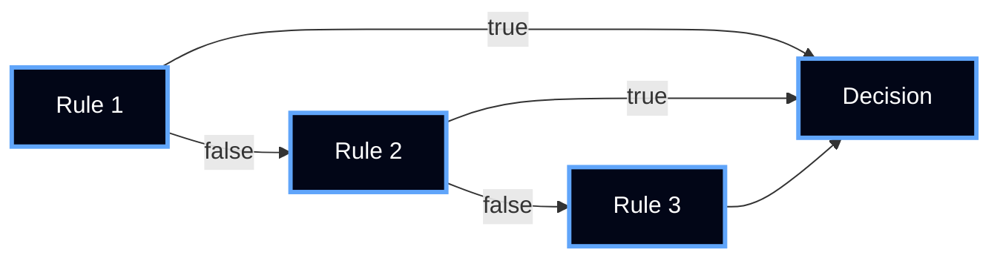

# Decision Engine

The Decision Engine is the **core deterministic computation layer** of Manthan.

It evaluates canonical input against **versioned rules** and produces a **single, predictable decision**.

---

## Core Principle

> Same Input + Same Rules → Same Decision

---

## Position in System


---

## Input

The engine operates ONLY on canonicalized input.

### Properties

- Deterministic structure  
- Stable ordering  
- No ambiguity  

---

## Rule Model

Rules are defined inside contracts.

### Example

```yaml
rules:
  - condition: "amount > 10000"
    action: "reject"

  - condition: "country == 'high_risk'"
    action: "reject"

  - condition: "true"
    action: "approve"
```

---

## Execution Rules

The engine MUST follow strict deterministic behavior:

### 1. Fixed Order
Rules are evaluated **top → bottom**

### 2. First Match Wins
- First TRUE condition → decision  
- Remaining rules ignored  

### 3. No Randomness
- No probabilistic outputs  
- No model inference  

### 4. No Side Effects
- Pure function  
- No external calls  

---

## Evaluation Flow



---

## Example Execution

### Input

```json
{
  "amount": 12000,
  "country": "low_risk"
}
```

---

### Evaluation

- Rule 1 → TRUE  
- Decision = reject  
- Execution stops  

---

### Output

```json
{
  "decision": "reject",
  "reason": "amount threshold exceeded"
}
```

---

## Deterministic Properties

| Property | Guarantee |
|----------|----------|
| Execution order | Fixed |
| Rule evaluation | Deterministic |
| Output | Stable |
| State | Stateless |

---

## Constraints

The Decision Engine MUST:

- Use canonical input  
- Execute rules in fixed order  
- Stop at first match  
- Produce exactly one decision  

---

## What It Does NOT Do

- No learning  
- No probabilistic scoring  
- No external API calls  
- No hidden state  

---

## System Role

The Decision Engine:

- Defines the final decision  
- Acts as the system authority  
- Guarantees determinism  

---

## Summary

The Decision Engine is a **pure deterministic rule evaluator**.

---

## Core Statement

> The engine does not infer.  
> It executes rules deterministically.