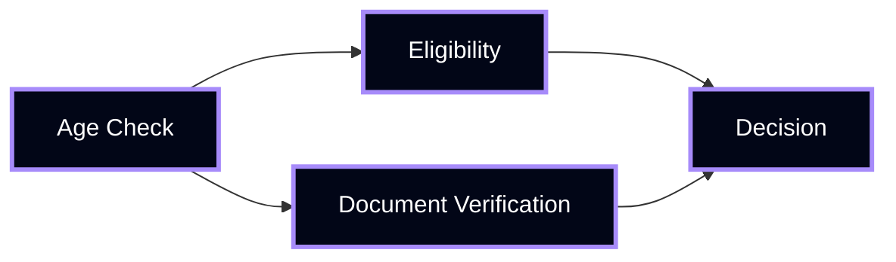

# Example Walkthrough

This section demonstrates how Manthan produces **deterministic decisions** using real scenarios.

---

## Example 1 — High Transaction Risk

### Input
```json
{
  "amount": 15000,
  "country": "high_risk",
  "user_verified": false
}
```

### Rules
```text
IF amount > 10000 → reject
IF country == high_risk → reject
```

### Decision Flow
- amount > 10000 → TRUE  
- First match → reject  

### Output
```json
{
  "decision": "reject",
  "reason": "amount threshold exceeded"
}
```

---

## Example 2 — Safe Transaction

### Input
```json
{
  "amount": 2000,
  "country": "low_risk",
  "user_verified": true
}
```

### Rules
```text
IF amount > 10000 → reject
ELSE → approve
```

### Decision Flow
- amount > 10000 → FALSE  
- No reject rule matched → approve  

### Output
```json
{
  "decision": "approve",
  "reason": "within safe limits"
}
```

---

## Example 3 — Decision Graph Execution

### Input
```json
{
  "user_age": 17,
  "document_verified": false
}
```

### Graph



### Logic
- user_age < 18 → not eligible  
- document_verified = false → fail  

### Output
```json
{
  "decision": "reject",
  "reason": "age and verification failure"
}
```

---

## Example 4 — Contract-Based Decision

### Contract (v1.0)
```yaml
rules:
  - condition: "score < 50"
    action: "reject"
  - condition: "score >= 50"
    action: "approve"
```

### Input
```json
{
  "score": 72
}
```

### Evaluation
- score < 50 → FALSE  
- score >= 50 → TRUE  

### Output
```json
{
  "decision": "approve",
  "contract_version": "v1.0"
}
```

---

## Determinism Proof

For ALL examples:

```text
Same Input → Same Rules → Same Output
```

No randomness  
No ambiguity  
No hidden state  

---

## Key Takeaway

Manthan converts:

> Inputs → Rules → Decisions  

Into a **fully deterministic system**.