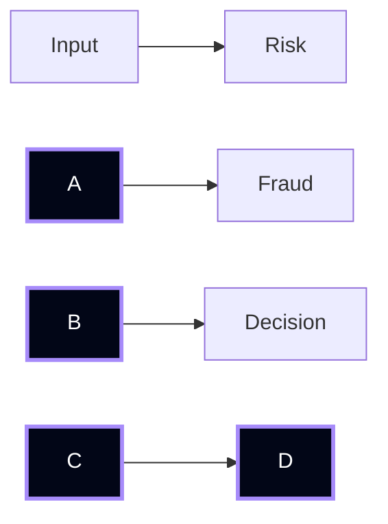

\# Decision Graphs

Defines dependency-based execution.

\---

\## Graph

\---

\## Rules

\- DAG only  

\- No cycles  

\- Fixed order  

\---

\## Guarantee

> Deterministic dependency execution

