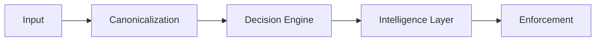
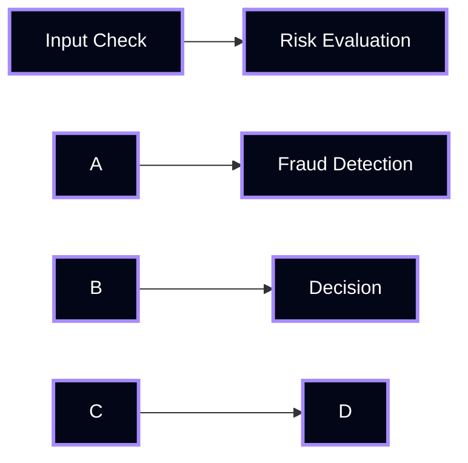
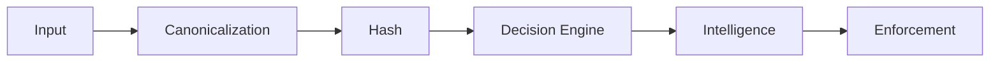

\# How It Works


Manthan executes decisions through a \*\*deterministic pipeline\*\*.


\---


\## End-to-End Flow





\---


\## Step 1 — Canonicalization


\*\*Goal:\*\* Remove ambiguity from input


\### What happens:

\- Keys are sorted

\- Values are normalized

\- Structure is stabilized


\### Output:

A \*\*canonical representation\*\* of input


```text

Same logical input → Same canonical form

```


\---


\## Step 2 — Deterministic Hash


\*\*Goal:\*\* Create stable identity for input


\### What happens:

\- Canonical input → hashed

\- Same input → same hash

\- Different input → different hash


\### Output:

A \*\*deterministic identifier\*\*


\---


\## Step 3 — Decision Engine


\*\*Goal:\*\* Compute decision using rules


\### Rules:

\- Fixed execution order  

\- First-match wins  

\- No randomness  


\### Example:


```text

IF amount > 10000 → reject

ELSE → approve

```


\### Output:

A \*\*deterministic decision\*\*


\---


\## Step 4 — Intelligence Layer


\*\*Goal:\*\* Add structured metadata


\### Adds:

\- Score  

\- Confidence  

\- Priority  

\- Explanation  


\### Important:

This layer \*\*DOES NOT change the decision\*\*


\---


\## Step 5 — Decision Graph (if applicable)


\*\*Goal:\*\* Handle multi-step dependencies


\### Properties:

\- DAG only  

\- No cycles  

\- Topological execution  


\### Example:





\---


\## Step 6 — Enforcement


\*\*Goal:\*\* Apply decision externally


\### Examples:

\- Block GitHub PR  

\- Reject API request  

\- Trigger workflow  


\### Output:

\*\*Real-world effect\*\*


\---


\## Determinism Guarantee


Manthan guarantees:


> \*\*Same Input → Same Output → Always\*\*


\---


\## Why This Matters


Without determinism:


\- Decisions cannot be trusted  

\- Systems cannot be audited  

\- Outcomes cannot be enforced  


With Manthan:


\- Every decision is traceable  

\- Every output is predictable  

\- Every action is enforceable  


\---


\## Execution Summary





\---


\## Core Principle


> Determinism is not a feature.  

> It is the foundation.

