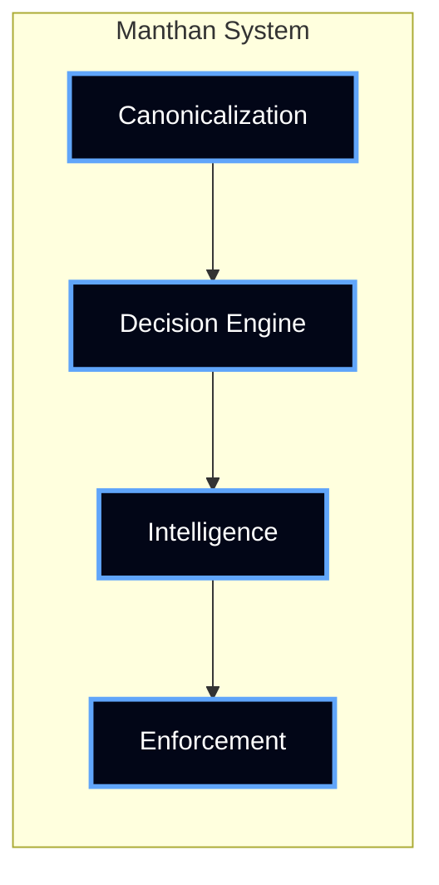

# Manthan

## Decision Operating System for AI

Build systems where decisions are **deterministic, auditable, and enforceable**.

---

## Problem

AI systems today are fundamentally unreliable:

- Same input → different outputs  
- No traceability  
- No enforcement  
- No system guarantees  

---

## Solution

Manthan introduces a **deterministic decision layer**.

---

## Core Principle

> Same Input → Same Output → Always

---

## What Manthan Provides

### Deterministic Execution
- Rule-based decisions  
- Fixed execution order  
- No randomness  

### Decision Governance
- Versioned contracts  
- Immutable logic  
- Full audit trail  

### Enforcement Layer
- GitHub PR blocking  
- API enforcement  
- Workflow control  

---

## How It Works

1. Canonicalize input  
2. Evaluate rules deterministically  
3. Add structured intelligence  
4. Enforce outcome  

---

## System Architecture

---

## Why It Matters

Without determinism:

- Decisions cannot be trusted  
- Systems cannot be audited  
- Outcomes cannot be enforced  

With Manthan:

- Every decision is reproducible  
- Every action is traceable  
- Every outcome is enforceable  

---

## Explore

- [Architecture](architecture.md)
- [How It Works](how-it-works.md)
- [Decision Engine](decision-engine.md)
- [Intelligence Layer](intelligence.md)
- [Decision Graphs](graphs.md)
- [Contracts](contracts.md)
- [API Reference](api.md)

---

## Positioning

Manthan is **Decision Infrastructure**.

---

## System Guarantee

> Every decision is traceable, auditable, and built for trust.