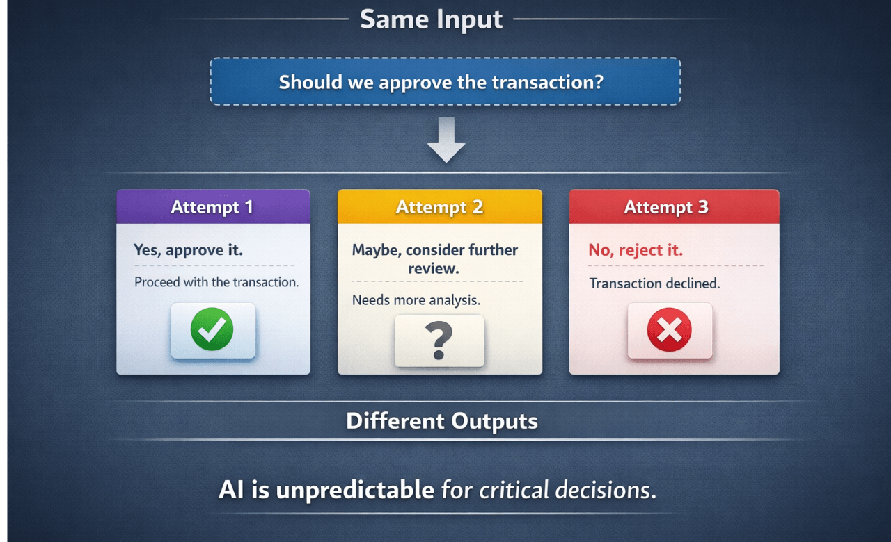
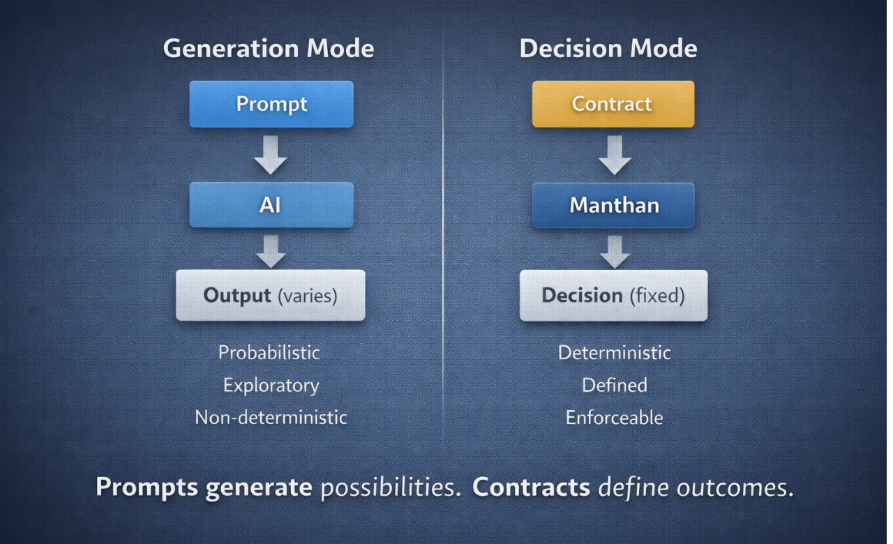
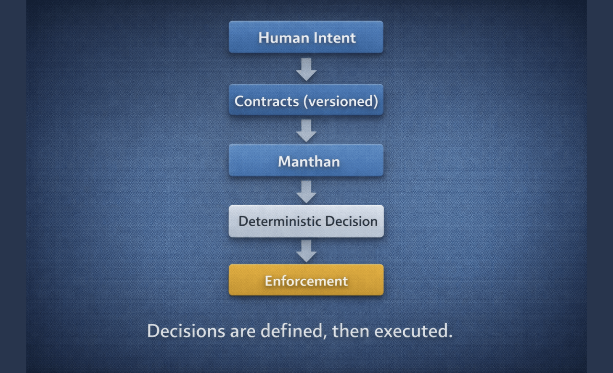
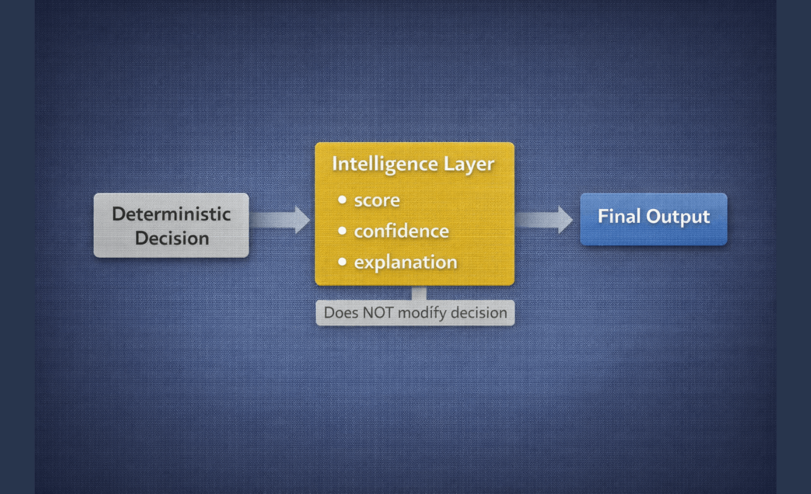

<h1>System</h1>

Manthan defines how decisions are made, validated, and enforced in software systems.

<h2>The Problem</h2>

AI systems operate in probabilistic generation.

<ul>
<li>Same input → different outputs</li>
<li>No traceability</li>
<li>No enforcement</li>
</ul>

<strong>This makes them unreliable for decisions.</strong>

<h2>Generation vs Decision</h2>

AI operates in <strong>generation mode</strong>. 
Manthan operates in <strong>decision mode</strong>.

<ul>
<li>Generation → possibilities</li>
<li>Decision → outcomes</li>
</ul>

Prompts generate. 
Contracts decide.

<h2>Decision Boundary</h2>

AI is useful for ambiguity. 
Decisions require certainty.

<strong>AI (Generation)</strong>

<ul>
<li>Interpretation</li>
<li>Exploration</li>
<li>Ambiguity</li>
</ul>

<strong>Decision Systems</strong>

<ul>
<li>Determinism</li>
<li>Enforcement</li>
<li>Guarantees</li>
</ul>

Crossing this boundary turns insight into decision.

<h2>System Model</h2>

A Manthan system follows a deterministic structure:

<ul>
<li>Intent → defined as contracts</li>
<li>Contracts → define decisions</li>
<li>Decisions → executed deterministically</li>
<li>Execution → enforced by the system</li>
</ul>

<h2>Contracts</h2>

Contracts define decisions explicitly.

<ul>
<li>Versioned</li>
<li>Immutable</li>
<li>Deterministic</li>
</ul>

They are the source of truth.

Decisions are not inferred. 
<strong>They are specified.</strong>

<h2>Intelligence Layer</h2>

Decisions are made first.

<ul>
<li>Explanation</li>
<li>Context</li>
<li>Scoring</li>
</ul>

This layer does not influence decisions. 
<strong>It explains decisions — it never makes them.</strong>

<h2>Outcome</h2>

<strong>Without deterministic decisions:</strong>

<ul>
<li>Inconsistent outcomes</li>
<li>No traceability</li>
<li>No enforcement</li>
</ul>

<strong>With Manthan:</strong>

<ul>
<li>Consistent decisions</li>
<li>Full traceability</li>
<li>Enforced outcomes</li>
</ul>

<strong>Reliable systems require deterministic decisions.</strong>

