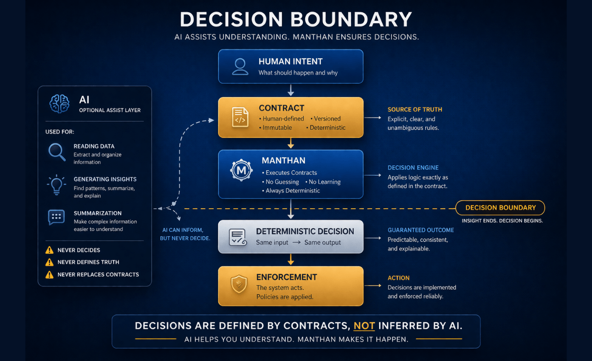
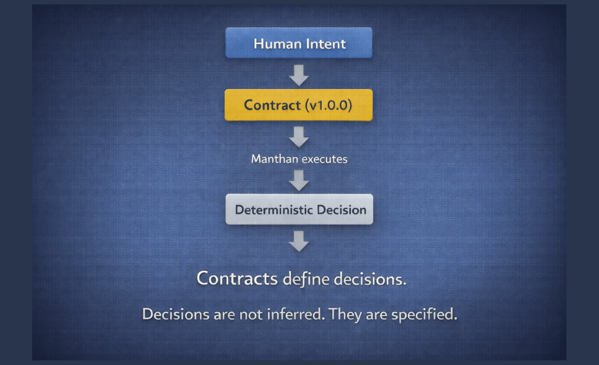
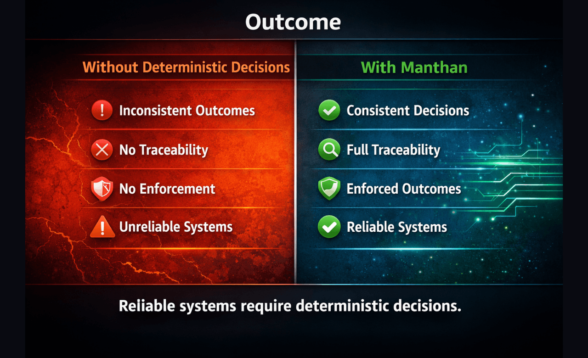

<h1>System</h1>

How decisions are made in Manthan.

<h2>The Problem</h2>

AI systems are probabilistic.

The same input can produce different outputs.

There is no traceability.

There is no enforcement.

This makes them unreliable for decisions.

<h2>Generation vs Decision</h2>

AI operates in generation mode.

Manthan operates in decision mode.

Prompts generate possibilities.

Contracts define outcomes.

Generation is not decision-making.

<h2>Decision Boundary</h2>

<strong>AI is useful for:</strong>

<ul>

<li>Ambiguity</li>

<li>Interpretation</li>

<li>Exploration</li>

</ul>

<strong>Decisions require:</strong>

<ul>

<li>Determinism</li>

<li>Enforcement</li>

<li>Guarantees</li>

</ul>

Crossing the boundary turns insight into decision.

<h2>Architecture</h2>

Decisions originate from human intent.

Intent is defined as contracts.

Contracts are executed by Manthan.

Execution produces deterministic decisions.

Decisions are enforced by the system.

<h2>Contracts</h2>

<ul>

<li>Versioned</li>

<li>Immutable</li>

<li>Deterministic</li>

</ul>

Contracts are the source of truth.

Decisions are not inferred.

They are specified.

<h2>Intelligence Layer</h2>

Decisions are made first.

<ul>

<li>Explanation</li>

<li>Context</li>

<li>Scoring</li>

</ul>

It does not influence the decision.

It explains decisions, never makes them.

<h2>Outcome</h2>

<strong>Without deterministic decisions:</strong>

<ul>

<li>Inconsistent outcomes</li>

<li>No traceability</li>

<li>No enforcement</li>

</ul>

<strong>With Manthan:</strong>

<ul>

<li>Consistent decisions</li>

<li>Full traceability</li>

<li>Enforced outcomes</li>

</ul>

<strong>Reliable systems require deterministic decisions.</strong>

